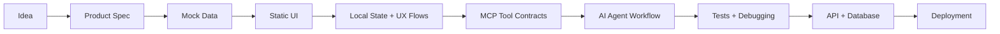
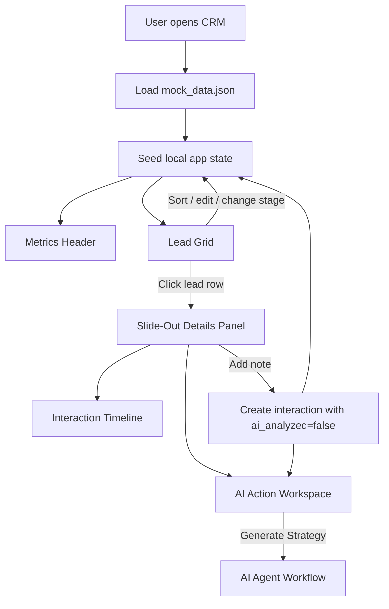
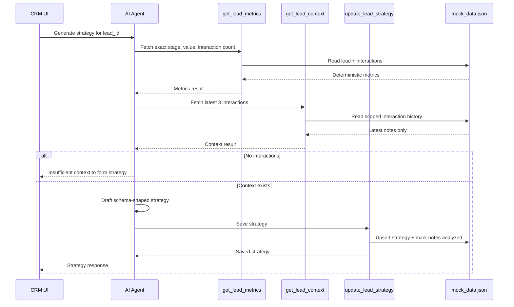
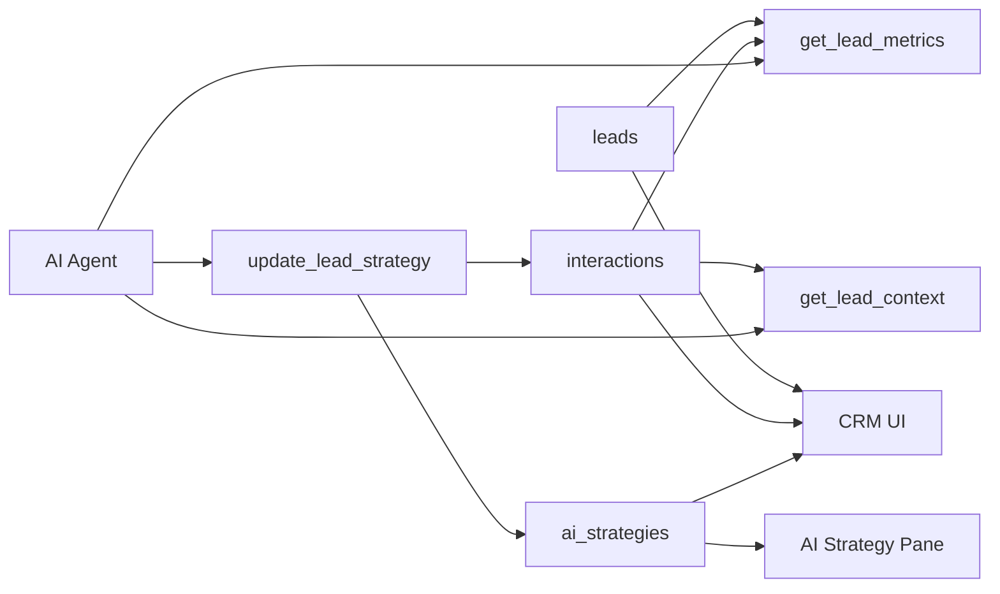
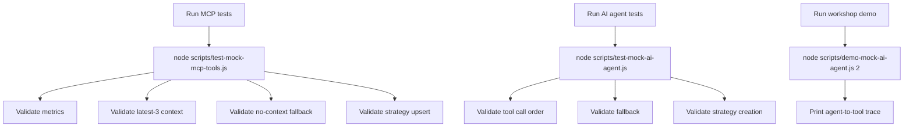

# Smart AI CRM Workshop

Hands-on workshop repo for building a Smart AI CRM + Lead Tracker with a UI-first workflow, mock data, MCP-style tools, and a testable AI agent loop.

## End-to-End Workshop Flow



## Application Flow



## MCP + AI Agent Flow



## Data Flow



## Local Test Flow



## Useful Commands

```sh
node scripts/test-mock-mcp-tools.js
node scripts/test-mock-ai-agent.js
node scripts/demo-mock-ai-agent.js 2
node scripts/demo-mock-ai-agent.js 50
```

Lead `2` shows the full multi-tool path. Lead `50` shows the no-context guardrail path.

## Spec Map

- [Specification index](spec.md)
- [UI stage](specs/02-ui-stage.md)
- [Mock data contract](specs/03-mock-data-contract.md)
- [Interaction flow](specs/04-interaction-flow.md)
- [API contract](specs/05-api-contract.md)
- [AI MCP flow](specs/07-ai-mcp-flow.md)
- [Quality gates](specs/08-quality-gates.md)
